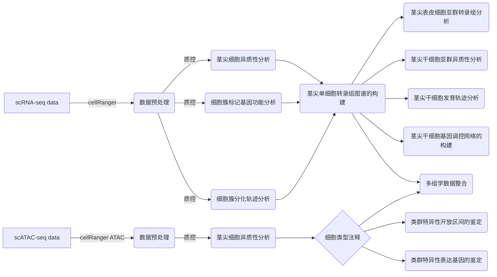
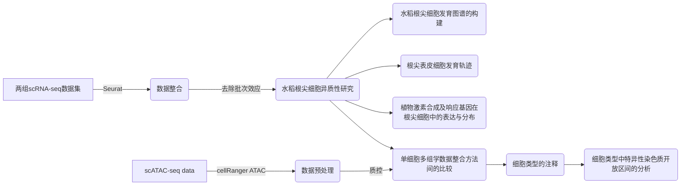

# 水稻顶端分生组织单细胞转录组与染色质可及性研究
## 论文内容简介  
&emsp;在植物的整个生命周期中，顶端分生组织是维持其不断生长和发育的重要组织。植物的顶端分生组织分为茎端分生组织（Shoot Apical Meristem，SAM）和根端分生组织（Root Apical Meristem，RAM），它们主要分布于植物的茎尖和根尖。茎端分生组织和根端分生组织都具有自我更新和无限分化的潜能，能够通过其组织内干细胞的分裂和分化实现自身的增殖与其他组织器官的形成。水稻是世界主要的粮食作物，在国家粮食安全保障体系中占有重要地位。随着世界人口数量的不断增加，耕地面积的不断减少，培育优质高产水稻品种是提高粮食产量的一个重要途径。在水稻中，顶端分生组织的生长发育影响着众多的农业性状（如穗粒数，穗粒重，植株高度，分蘖数等）。因此，深入研究水稻顶端分生组织发生及发育的分子机制，将为进一步提升水稻产量和品质提供坚实的理论基础。  
&emsp;单细胞测序是一种新的测序方法，该方法以单个细胞为对象，通过对细胞内基因组、转录组等遗传物质进行扩增测序，进而完成对单个细胞中多种组学信息的检测。为更加精确地解析茎端或根端分生组织中不同类型的细胞在时间和空间梯度上的差异，构建组织内细胞的分化发育轨迹，揭示顶端分生组织不断生长背后所涉及的转录调控机制，本研究以茎端和根端分生组织为对象，采用单细胞转录组和单细胞染色质可及性测序技术开展了多方面的研究。

## 仓库信息 
在该仓库中可以查询到与论文各个章节主要结果相关的生信分析流程与分析程序。由于仓库仍处于开发中，如遇问题可发送邮件至610498675@qq.com。

## 生信分析环境的搭建  
推荐使用conda搭建论文的生信分析环境，关于conda的安装与使用请[点击](https://docs.conda.io/en/latest/)。  
**创建环境**
```
conda create -n sc-env
```

**安装R分析环境所需软件**
```
conda install -c bioconda -c conda-forge -c bu_cnio -c bioturing r-seuratdata r-seuratwrappers \
        bioconductor-cicero bioconductor-rsamtools bioconductor-motifmatchr bioconductor-jaspar2020 \
        bioconductor-tfbstools bioconductor-monocle r-ggplot2 r-seurat r-seuratdisk  \
        r-seuratObject r-velocyto.r r-signac r-monocle3 r-wgcna r-igraph r-devtools r-base r-cairo
```
**安装python分析环境所需软件**
```
conda install -c bioconda -c conda-forge python scanpy scvelo numpy pandas matplotlib loompy velocyto.py
```

## 一、水稻茎端分生组织单细胞转录组与染色质可及性图谱绘制
### 本章节主要内容概览

___
### 1.1 单细胞转录组分析结果
#### 1.1.1 数据预处理
本研究使用10x Genomics官方软件Cell Ranger（v.6.0.2）构建单细胞基因表达矩阵。
```
cellranger count --id=scRNA_Rice_SAM --transcriptome=/gss1/home/yanwk/seqlib/cellRanger_genome/rice/cellranger-RNA-IRGSP-genome/Oryza_sativa_IRGSP \
                 --fastqs=/gss1/home/yanwk/ywk_Graduation_Project/00-SingleCell-data/02-Rice/02-Rice-Shoot/01-Mydata \
                 --force-cells=10000   
```
#### 1.1.2 茎尖细胞异质性分析
基于`cellranger`生成的单细胞基因表达矩阵，我们将对其再次进行质量控制与过滤。随后，完成对细胞的聚类和分群。  

[数据质控流程](script/Chapter1/scRNA-analysis/quality-control.r)：**图2-4**(不同质控条件下的数据分布)  
[聚类分群流程](script/Chapter1/scRNA-analysis/cell-clustering.r)：**图2-5**(水稻茎尖单细胞转录组图谱的构建)  

#### 1.1.3 类群标记基因的鉴定
[细胞簇标记基因分析流程](script/Chapter1/scRNA-analysis/DEGs-analysis.r)：**图2-5**(水稻茎尖单细胞转录组图谱的构建)；**图2-6**(水稻茎尖单细胞图谱中不同细胞类群在其功能上的差异性)

#### 1.1.4 细胞簇分化轨迹分析
本小节分析流程主要由三个步骤组成，分别是：（1）[loom文件的生成](script/Chapter1/scRNA-analysis/RNA-velocity-1.sh)；（2）[转录剪切矩阵的生成](script/Chapter1/scRNA-analysis/RNA-velocity-2.r)；（3）[RNA速率的计算](script/Chapter1/scRNA-analysis/RNA-velocity-3.py)。主要分析结果参见**图2-7**(水稻茎端细胞动态发育轨迹的构建)

#### 1.1.5 水稻茎尖表皮细胞亚群转录组分析
本小节的分析流程中包括单细胞亚群的提取、差异表达基因分析、火山图、柱状图的绘制。  
[主要分析流程](script/Chapter1/scRNA-analysis/epidermis-analysis.r)：**图2-9**(表皮细胞亚群间的差异表达分析)

#### 1.1.6 水稻茎尖干细胞亚群异质性分析
本小节分析主要涉及单细胞亚群的提取、再次聚类分群、基因集富集表达分析。  
主要分析流程请点击：[干胞亚群聚类分群流程](script/Chapter1/scRNA-analysis/meristem-analysis-1.r)。  
主要分析结果参见**图2-10**(分生细胞类群的异质性)。

#### 1.1.7 水稻茎尖干细胞亚群发育轨迹和基因调控网络的构建
**Palantir**的使用、调控网路的构建请点击[水稻茎尖干细胞亚群发育轨迹分析](script/Chapter1/scRNA-analysis/meristem-analysis-2.py)和[水稻茎尖干细胞亚群发育轨迹调控网络分析](script/Chapter1/scRNA-analysis/meristem-GRN-analysis-2.r)。主要分析结果参见**图2-11**(茎尖分生细胞分化轨迹)和**图2-12**(茎尖分生细胞分化过程中转录调控网络的构建)。
___
### 1.2 单细胞染色质可及性分析结果
#### 1.2.1 测序数据预处理
```
cellranger-atac count --id SAM --reference /home/wkyan/ywk_lab/04-scATAC-analysis/00-seqlib/IRGSP \
                      --fastqs /home/wkyan/ywk_lab/04-scATAC-analysis/01-raw-data/03-Shoot/data \
                      --sample S_20201215NA --force-cells 8000
```
#### 1.2.2 基于染色质可及性的水稻茎尖细胞异质性分析
本论文中的单细胞染色质可及性数据主要使用Signac软件进行分析，由于该软件的分析流程中需要使用基因组信息，因此需先在R中构建水稻的`BSgenome`包，方便后续的加载与使用。构建流程请点击：[BSgenome的构建](script/Chapter1/scATAC-analysis/BSgenome-create.sh)  
本节分析主要由以下三方面内容组成，详细分析流程如下所示：  
[数据信息统计](script/Chapter1/scATAC-analysis/data-info-analysis.sh)：**图2-13**(水稻茎尖单细胞染色质可及性数据质量)  
[数据质控流程](script/Chapter1/scATAC-analysis/quality-control.r)：**图2-14**(不同质控条件下的数据分布)  
[聚类分群流程](script/Chapter1/scATAC-analysis/cell-clustering.r)：**图2-15**(水稻茎尖单细胞染色质可及性图谱的构建)  

#### 1.2.3 细胞类型的注释
本节分析首先从染色质可及性与基因表达水平之间的相关性入手，通过整合RNA与ATAC两类单细胞数据对，细胞类型进行注释。  
[染色质可及性与基因表达关系分析](script/Chapter1/scATAC-analysis/RNA-ATAC-relation-analysis.sh)：**图2-16A**(水稻茎尖单细胞染色质可及性图谱中细胞类型的注释)  
[注释工作的分析流程](script/Chapter1/scATAC-analysis/scRNA-scATAC-annotation.r)：**图2-16**(水稻茎尖单细胞染色质可及性图谱中细胞类型的注释)；**图2-17**(五个细胞类群在功能上的差异性)  


## 二、水稻根端分生组织单细胞转录组与染色质可及性图谱绘制
### 本章节主要内容概览

___

### 2.1 单细胞转录组分析结果
#### 2.1.1 水稻根尖细胞异质性研究
[两组水稻根尖单细胞转录组数据的整合流程](script/Chapter2/scRNA-analysis/scRNA-integrated.r)  
[细胞类群的注释流程](script/Chapter2/scRNA-analysis/scRNA-integrated.r)

#### 2.1.2 水稻根尖细胞发育图谱的构建

[根尖细胞发育图谱的构建流程](script/Chapter2/scRNA-analysis/scRNA-Development-analysis.r)

#### 2.1.3 根尖表皮细胞发育轨迹

[根尖表皮细胞发育轨迹分析流程](script/Chapter2/scRNA-analysis/scRNA-epidermal-analysis.r)

#### 2.1.4 植物激素合成及响应基因在根尖细胞中的表达与分布

[植物激素合成及响应基因分析流程](script/Chapter2/scRNA-analysis/scRNA-Phytohormones-analysis.r)

## 三、单细胞精度下茎端与根端分生组织差异性研究

